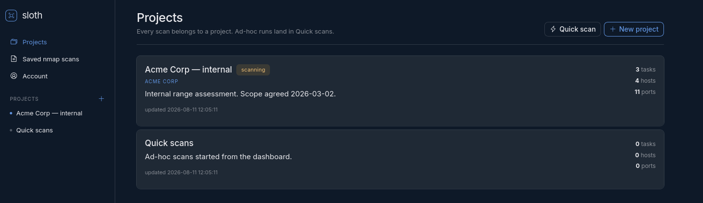
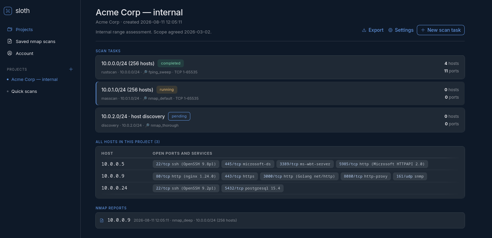
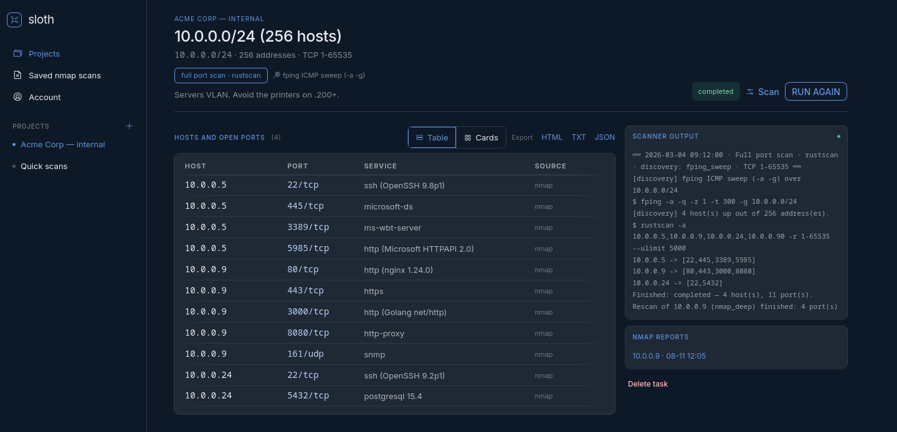
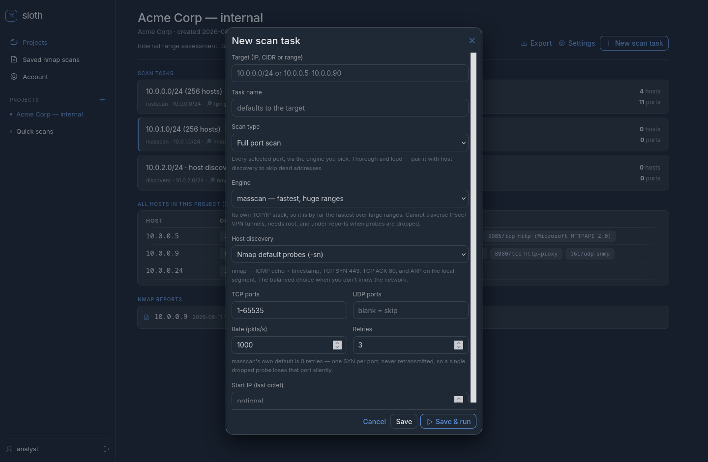
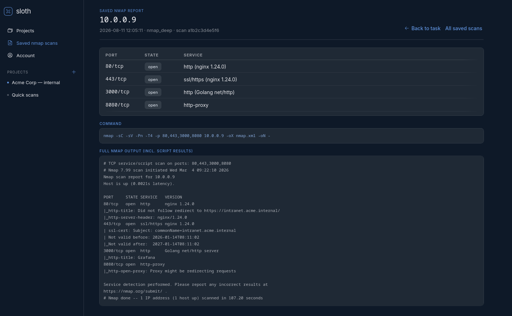

# Sloth

A web front-end for `masscan` and `nmap` that keeps its results. Scans live
inside **projects**; each project holds **tasks** (one target range each), and a
task's findings are written to SQLite as they arrive — so you can close the tab,
restart the server, and open the project later to read the results.

## Screenshots

Every scan belongs to a project; ad-hoc runs land in "Quick scans".



A project holds tasks — one target range each — with every host it has found
across all of them.



Results stream in live. Hosts render as a table (one row per port, for a sweep
that turned up dozens) or as cards, and the scanner's own output sits alongside
so a scan that found nothing still explains itself.



Each run picks its own engine and discovery probe, and every choice states the
trade-off it carries.



Per-host nmap scans are saved in full, script output included.



Regenerate with `./make-screenshots.py` — it renders the real pages against a
throwaway database of invented data.

## Install

From the Debian package (Debian, Ubuntu, Kali):

```bash
sudo apt install ./sloth_2.1.0_all.deb
sudo systemctl enable --now sloth
```

Or run straight from a checkout:

```bash
sudo python scanner.py
```

Then open <http://127.0.0.1:9998>. The first visit asks you to create an
account — there is no default password. Root is required because masscan needs
raw sockets; the app warns and refuses to start a sweep without it.

## Authentication

Every page and endpoint requires a signed-in session. The first request to a
fresh install goes to `/setup` to create the account; after that `/setup` is
closed and only `/login` is public.

- Passwords are stored as **scrypt** hashes (via Werkzeug), minimum 10 characters.
- Failed logins are throttled per client address — 8 misses buys a 5-minute
  lockout — and an unknown username costs the same time as a wrong password, so
  the response cannot be used to enumerate accounts.
- Sessions are `HttpOnly`, `SameSite=Lax`, and expire after 12 hours
  (`SLOTH_SESSION_HOURS`). Set `SLOTH_HTTPS=1` to add the `Secure` flag when
  serving over TLS.

### API tokens for scripts

Browser sessions would make the tool unscriptable, so generate a token under
**👤 your name → API token**:

```bash
curl -H "Authorization: Bearer $TOKEN" http://127.0.0.1:9998/tasks/<id>/state
```

`X-API-Token: <token>` works too. Only the hash is stored, so a token is shown
once and regenerating replaces it. Token-authenticated requests skip the CSRF
check — they carry no browser origin and cannot be forged from a victim's
browser — so automation keeps working without weakening the browser path.

## A task is a target, not a single scan

The scan settings on a task are just *the last ones used*. Open a task, hit
**⚙ SCAN**, change the type, engine or port range, and press START — the new run
goes against the same target and its findings **accumulate**. Nothing is
replaced.

That makes the natural workflow possible in one place:

1. **Host discovery** over the range to see what's actually there.
2. **Quick scan** (nmap top ports) for a fast picture of each live host.
3. **Full port scan** with whichever engine suits the path, to catch the rest.
4. **Nmap deep rescan** per host for versions, scripts and screenshots.

Every port badge carries a tooltip naming the engine that found it, and the
scanner log keeps every run under its own timestamped header.

## Scan types

Pick one per run:

| Type | What runs | Use it for |
|---|---|---|
| **Full port scan** | Every selected port, via your chosen engine | Thorough coverage. Pair it with discovery. |
| **Quick scan** | nmap over its top N ports, with service detection | A fast look at what's really exposed. |
| **Host discovery** | A discovery probe only, no port scan | Mapping a range before deciding where to look. |

### Full-scan engines

| Engine | Speed | Tunnels | Root | Notes |
|---|---|---|---|---|
| **masscan** | fastest | ✗ **cannot** | required | Own TCP/IP stack. Unbeatable over large ranges. |
| **rustscan** | fast | ✓ | no | Kernel TCP connect. TCP only. |
| **nmap** | slowest | ✓ | no | Retransmits and fingerprints. Most trustworthy. |

**masscan cannot scan through an IPsec or VPN tunnel.** It writes raw frames
straight to a network adapter, so the kernel never applies its IPsec transform —
packets leave unencrypted from the wrong source address and are dropped. The
scan then reports an empty host, which looks exactly like a quiet one. The tool
detects this (via the kernel's outbound xfrm policies) and warns before running.
Pick rustscan or nmap for anything behind a tunnel.

## Host discovery

Any scan type can run a discovery pass first. Only the addresses that answer get
port-scanned, so a /24 sweep drops from 254 targets to the handful that exist —
much less traffic and much less noise.

The probe matters: plenty of hosts drop ICMP echo but answer a timestamp
request, a TCP ACK to 443, or an ARP who-has. Available profiles:

| Profile | Tool | Notes |
|---|---|---|
| Nmap default (`-sn`) | nmap | ICMP + TCP 443/80 + ARP. The balanced default. |
| ICMP echo (`-PE`) | nmap | Classic ping; commonly filtered. |
| ICMP timestamp (`-PP`) | nmap | Often answered when `-PE` is dropped. |
| ICMP address mask (`-PM`) | nmap | Rare, but finds old network gear. |
| TCP SYN ping (`-PS`) | nmap | Gets through ICMP-blocking firewalls. |
| TCP ACK ping (`-PA`) | nmap | Slips past stateless filters. |
| UDP ping (`-PU`) | nmap | ICMP unreachable proves the host is there. |
| SCTP INIT (`-PY`) | nmap | Niche; telecom and some Linux hosts. |
| ARP ping (`-PR`) | nmap | Unfilterable and fast — local segment only. |
| Nmap thorough | nmap | Every probe type. Most effective, loudest. |
| fping sweep | fping | Fast parallel ICMP; great for large ranges. |
| fping patient | fping | Retries and longer timeouts for lossy links. |
| masscan `--ping` | masscan | ICMP at masscan speed; a /8 is realistic. |
| hping3 ICMP / SYN | hping3 | One crafted packet per host. Sequential, so capped at 256 addresses. |

Discovery-only runs record hosts that are up even when they have no open ports.

## Workflow

1. **Create a project** on the dashboard (client, scope notes).
2. **Add a task** to it — target, scan type, discovery method, ports.
3. **Run it.** Hosts and ports stream in live and are saved as they are found.
4. **Rescan a host** with nmap (`-sC -sV` on TCP, `-sU` on UDP) restricted to the
   ports masscan already found. Web ports get a headless-browser screenshot.
5. **Open the project any time** to browse every host, port and nmap report, or
   export the whole thing.

The dashboard also has a **Quick scan** box for one-off work; those tasks land in
an automatically created "Quick scans" project.

## Controls

| Action | What actually happens |
|---|---|
| Pause  | `SIGSTOP` to the scanner's process group — freezes mid-sweep, instantly |
| Resume | `SIGCONT` |
| Stop   | `SIGCONT` + `SIGINT`, so masscan writes `paused.conf`, then `SIGKILL` after a grace period |
| Resume saved | `masscan --resume paused.conf`, continuing where the stop left off |

Per-host rescans run in the background and report over the same event stream, so
a slow nmap can't time the browser out — you can close the tab and come back.
Each rescanning host card carries its own **✕ Stop**, which reaches only that
host: the sweep and any other host's rescan keep going. What a stop keeps
depends on when it lands —

| Stopped during | Result |
|---|---|
| the nmap scan | discarded — the output was cut off mid-scan |
| the screenshot pass | nmap results kept and saved; the report notes how many captures were taken |

Screenshot browsers are spawned through the process registry too, so a stop
reaches them as well — a headless capture aimed at an unresponsive host would
otherwise sit there for the full 45-second timeout, per port.

Signals go only to that task's own children. Nothing else on the machine is
touched.

If connectivity drops mid-scan a watchdog freezes the sweep and says so; the
processes are suspended, not killed, so nothing is lost.

Only one sweep runs at a time — masscan saturates the link, so a second start
returns a clear "already running" message rather than competing for bandwidth.

## Export

Per task or per project, in three formats:

- **HTML** — self-contained: ports, nmap services, raw nmap output and
  screenshots embedded as data URIs. No network needed to read it later.
- **TXT** — `ip:port (proto/state) service`, one per line.
- **JSON** — the full structure, for feeding something else.

## Interface

The UI is **Nocturne**, a design system exported from `Sloth.html` (a bundler
export from the design tool). `./extract-design.py` unpacks its stylesheet and
webfonts into `static/`:

```bash
./extract-design.py      # → static/css/nocturne.css + static/fonts/
```

Nothing is fetched at runtime — no CDN, no build step — so the interface renders
on a client network with no route out, which the previous Tailwind-from-CDN
setup did not.

- `static/css/nocturne.css` — the design system, regenerated, never hand-edited
- `static/css/sloth.css` — app layout on top of it (shell, sidebar, host views)
- `static/js/dialogs.js` — modal open/close
- `static/js/scan-fields.js` — shows only the fields a scan type and engine use
- `static/js/task.js` — the live scan view

Hosts render as either a **table** or **cards**; the toggle is remembered.

## Layout

```
scanner.py              entry point
sloth/
  config.py             paths and tuning (all overridable by env var)
  db.py                 schema + migrations
  auth.py               sessions, password hashing, API tokens, throttling
  store.py              queries for projects / tasks / findings
  scanconfig.py         scan types, engines, form parsing (create and re-run)
  discovery.py          host-discovery profiles, commands and parsers
  engine.py             phase orchestration, sweeps, rescans, watchdog
  procs.py              child-process registry: pause / resume / stop
  parsers.py            masscan and nmap output parsing
  netutil.py            target validation, connectivity check
  screenshots.py        headless-browser capture
  views/                Flask blueprints
templates/  static/     UI
scans.db                results
runs/<task_id>/         per-task working dir (masscan's paused.conf lives here)
screenshots/            captured PNGs
```

`scanner_v1_backup.py` is the previous single-file build, kept for reference.

## Clean source archive

```bash
./make-source-zip.py            # → dist/sloth-<version>-src.zip
```

For sharing or publishing the code without any of your engagement data. Files
are chosen from an explicit **allowlist** in the script — a denylist would
quietly ship whatever you add later that nobody remembered to exclude.

Never included: `scans.db` (projects, findings, **password and API-token
hashes**), `runs/` (the **session signing key**, scan logs, masscan resume files
naming your adapter and targets), `screenshots/` (captured images of client
systems), `dist/`, `__pycache__`.

Before writing the archive it scans everything staged and **refuses to build**
if it finds a password hash, an API token, a private key or a masscan resume
fragment. Stray IP addresses that don't look like documentation examples are
reported as a warning to eyeball rather than a hard failure.

The result is self-sufficient: extract it and you can run the tool and rebuild
the `.deb` from it.

## Building the .deb

```bash
./build-deb.sh            # → dist/sloth_<version>_all.deb
VERSION=2.2.0 MAINTAINER="You <you@example.com>" ./build-deb.sh
```

A `.deb` is an `ar` archive of `debian-binary`, `control.tar.gz` and
`data.tar.gz`, so the script builds one with nothing but `ar`, `tar` and `gzip`
— it works on non-Debian machines. If `dpkg-deb` is installed it is used
instead, since it also runs the usual consistency checks.

The package installs:

| Path | Contents |
|---|---|
| `/usr/lib/sloth/` | application code, templates, static files |
| `/usr/bin/sloth` | launcher (`--help`, `--version`, `--host`, `--port`) |
| `/lib/systemd/system/sloth.service` | service unit |
| `/etc/sloth/sloth.conf` | configuration (a conffile — your edits survive upgrades) |
| `/var/lib/sloth/` | database, run directories, screenshots |

The service runs as a dedicated **unprivileged** `sloth` account rather
than root. The scanners still get raw sockets through
`AmbientCapabilities=CAP_NET_RAW CAP_NET_ADMIN`, which child processes inherit
across exec — so masscan and fping work without handing the whole web
application root. When the code lives under `/usr`, the app puts its data in
`/var/lib/sloth` automatically; from a checkout it stays alongside the
source.

Scan results are engagement data, so `apt remove` leaves `/var/lib/sloth`
alone. Only `apt purge` deletes it, along with the config and the service user.

## Configuration

| Env var | Default | Purpose |
|---|---|---|
| `SLOTH_HOST` / `SLOTH_PORT` | `127.0.0.1` / `9998` | bind address |
| `SLOTH_DB` | `./scans.db` | database location |
| `SLOTH_RATE` | `1000` | default packet rate |
| `SLOTH_DEBUG` | off | Flask debugger — leave off, it is a remote shell and this runs as root |
| `SLOTH_SESSION_HOURS` | `12` | how long a login lasts |
| `SLOTH_HTTPS` | off | set when serving over TLS so the session cookie gets `Secure` |

## When masscan finds fewer ports than nmap

This is the normal failure mode, not a bug in the tool:

- **masscan defaults to `--retries 0`** — one SYN per port, never retransmitted.
  Against a host that drops packets (a firewalled Windows box, a rate-limiting
  router) a lost probe is indistinguishable from a closed port, and the port is
  silently missed. This tool now defaults to **3 retries**; masscan's own default
  of 0 is why a stateless sweep can report a nearly-empty host that nmap finds
  wide open.
- **Ports 2000 and 5060 answering when nothing else does** usually means a SIP
  ALG or SCCP-inspecting middlebox in the path replied, not the host. The tool
  warns when every port it found is one of those.
- **masscan cannot cross an IPsec/VPN tunnel at all** — see the engine table
  above. If the route to your target uses a tunnel, masscan will report
  almost nothing no matter how you tune it. Switch engine to rustscan or nmap.
- **For a single host or a handful, prefer nmap** with an explicit `1-65535`
  range. Slower, but it retransmits and reports service versions.

Rule of thumb: masscan to find hosts and ports across big ranges, nmap to
establish what is actually true about a specific host.

## Notes

- **masscan cannot scan localhost.** It drives its own userland TCP/IP stack and
  transmits through a network adapter, so packets to `127.0.0.0/8` never reach
  it — a loopback sweep reports nothing no matter what is listening. The tool
  warns in the scanner output when you aim at a loopback target. Use nmap for
  the local machine.
- The scanner output for each run is kept in `runs/<task_id>/scan.log` and
  redisplayed when you reopen the task, so you can see why a scan found nothing.
- **masscan cannot read its own resume file.** It writes `nocapture = servername`
  into `paused.conf` and then rejects that key on `--resume`. The tool strips it
  before resuming and notes it in the log; without that, resume fails instantly.
- **Cross-site POSTs are blocked, scripted ones are not.** Requests carrying a
  browser `Origin` must be same-origin and present a CSRF token; `curl` and
  scripts send no `Origin`, can't be a CSRF vector, and keep working unchanged.
- Deleting a task or project also removes its `runs/` directory and screenshots.
- The database upgrades itself in place. Scans saved by the old build are filed
  under a "Legacy scans" project on first run.
- The stray `paused.conf` in the repository root is left over from the old
  build; masscan resume files now live under `runs/<task_id>/`.
